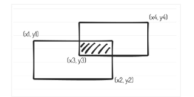
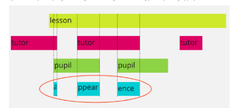

## Содержание
- [Задача 1](#задача-1)
- [Задача 2](#задача-2)
- [Задача 3](#задача-3)
- [Решение](#решение)


## Для прохождения интервью с командой необходимо выполнить следующее тестовое задание:

### Задача №1.

Дан массив чисел, состоящий из некоторого количества подряд идущих единиц, за которыми следует какое-то количество
подряд идущих нулей: 111111111111111111111111100000000.

Найти индекс первого нуля (то есть найти такое место, где заканчиваются единицы, и начинаются нули)

```python3
def task(array):
    pass


print(task("111111111110000000000000000"))

# >> OUT: 10
```

…

В функцию передаются координаты двух противоположных вершин одного прямоугольника и двух противоположных вершин второго
прямоугольника. Найти, пересекаются ли эти прямоугольники?

Немного посложнее – найти площадь пересечения



```python3
def task(x1, y1, x2, y2, x3, y3, x4, y4):
    pass


print(task(1, 1, 2, 2, 3, 3, 4, 4))
# >> OUT: False
```

### Задача №2.

В нашей школе мы не можем разглашать персональные данные пользователей, но чтобы преподаватель и ученик смогли объяснить
нашей поддержке, кого они имеют в виду (у преподавателей, например, часто учится несколько Саш), мы генерируем
пользователям уникальные и легко произносимые имена. Имя у нас состоит из прилагательного, имени животного и двузначной
цифры. В итоге получается, например, "Перламутровый лосось 77". Для генерации таких имен мы и решали следующую задачу:
Получить с русской википедии список всех животных (https://inlnk.ru/jElywR) и вывести количество животных на каждую
букву алфавита. Результат должен получиться в следующем виде:

```
А: 642
Б: 412
В:....
```

### Задача №3.

Мы сохраняем время присутствия каждого пользователя на уроке в виде интервалов. В функцию передается словарь, содержащий
три списка с таймстемпами (время в секундах):

**lesson** – начало и конец урока

**pupil** – интервалы присутствия ученика

**tutor** – интервалы присутствия учителя

Интервалы устроены следующим образом – это всегда список из четного количества элементов. Под четными индексами (начиная
с 0) время входа на урок, под нечетными - время выхода с урока.
Нужно написать функцию, которая получает на вход словарь с интервалами и возвращает время общего присутствия ученика и
учителя на уроке (в секундах).



```python3

def appearance(intervals):
    pass


tests = [
    {'data': {'lesson': [1594663200, 1594666800],
              'pupil': [1594663340, 1594663389, 1594663390, 1594663395, 1594663396, 1594666472],
              'tutor': [1594663290, 1594663430, 1594663443, 1594666473]},
     'answer': 3117
     },
    {'data': {'lesson': [1594702800, 1594706400],
              'pupil': [1594702789, 1594704500, 1594702807, 1594704542, 1594704512, 1594704513, 1594704564, 1594705150,
                        1594704581, 1594704582, 1594704734, 1594705009, 1594705095, 1594705096, 1594705106, 1594706480,
                        1594705158, 1594705773, 1594705849, 1594706480, 1594706500, 1594706875, 1594706502, 1594706503,
                        1594706524, 1594706524, 1594706579, 1594706641],
              'tutor': [1594700035, 1594700364, 1594702749, 1594705148, 1594705149, 1594706463]},
     'answer': 3577
     },
    {'data': {'lesson': [1594692000, 1594695600],
              'pupil': [1594692033, 1594696347],
              'tutor': [1594692017, 1594692066, 1594692068, 1594696341]},
     'answer': 3565
     },
]

if __name__ == '__main__':
    for i, test in enumerate(tests):
        test_answer = appearance(test['data'])
        assert test_answer == test['answer'], f'Error on test case {i}, got {test_answer}, expected {test["answer"]}'


```


### Решение
Код с решением заданий лежит в соотвествующих файлах:
 - Задание 1: [task1.1.py](https://github.com/joerude/tetrika-test/blob/master/task1.1.py) и [task1.2.py](https://github.com/joerude/tetrika-test/blob/master/task1.2.py)
 - Задание 2: [task2.py](https://github.com/joerude/tetrika-test/blob/master/task2.py).
    Для работы с API Wikipedia установите необходимые библиотеки `pip install -r requirements.txt`
 - Задание 3: [task3.py](https://github.com/joerude/tetrika-test/blob/master/task3.py)


